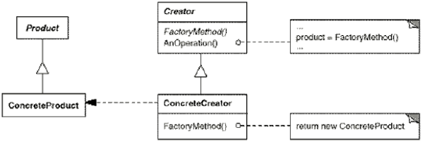

# 抽象工厂模式

## “对象创建”模式

> 通过“对象创建”模式绕开new，来避免对象创建（new）过程中所导致的紧耦合（依赖具体类），从而支持对象创建的稳定。它是接口抽象之后的第一步工作。

解决的是对象创建的问题

动机：

由于需求的变化，需要创建的对象的具体类型经常变化。

看到未来变化的需求，做抽象类和接口。面向接口的编程

想到变化的时候就需要抽象成基类，这是面向接口的设计的一部分。抽象基类

面向接口编程，最简单的表现就是变量要声明为基类。

为什么要实现面向接口编程？依赖倒置原则，依赖抽象而不是依赖具体实现细节。

仍然要依赖细节。

是第一步工作，是面向接口必须的要求，是进行赋值右边的操作。

不能直接创建，也不能new，通过一种方法来返回一个对象。new是一种特殊的返回对象的方法

依然是编译时依赖

virtual是运行时依赖

要交给未来 splitterFactory这个未来

需要指定一个工厂。

通过虚函数产生出了多态的new

也需要产生依赖，但是mainform里面没有具体类的依赖了。

并不是把变化消灭掉了，而是把它赶到局部的地方。

模式定义：

定义一个用于创建对象的接口，让子类决定实例化哪一个类。Factory Method使得一个类的实例化延迟（目的：解耦 手段：虚函数）到子类。 《设计模式》 GoF

工厂方法模式用于隔离类对象的使用者和具体类型之间的耦合关系。面对一个经常变化的具体类型，紧耦合关系（new）会导致软件的脆弱。

工厂方法模式通过面向对象的手法，将所要创建的具体对象工作延迟到子类，从而实现一种扩展（而非更改）的策略，较好地解决了这种紧耦合关系。

解决“单个对象”的需求变化，缺点在于要求创建方法/参数相同。

内存管理的问题

张老师，我看MVI的测试用例的时候发现了一些自认为关于工厂方法的不太对的地方，明天想做个汇报，这是我的ppt，您看一下有没有必要汇报一下，或者有什么错误的地方