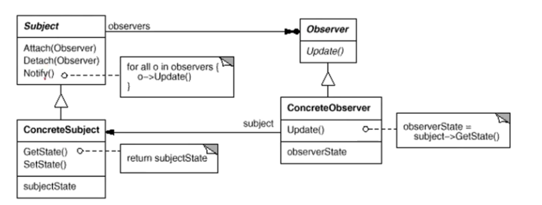

Observer 观察者模式

“组件协作”模式

解决的是框架和应用的协作问题

动机（Motivation）

- 在软件构建过程中，我们需要为某些对象建立一种“通知依赖关系“——一个对象（目标对象）的状态发生改变，所有依赖的对象（观察者对象）都将得到通知。如果这样的依赖关系过于紧密，将使软件不能很好地抵御变化。
- 使用面向对象技术，可以将这种依赖关系弱化，并形成一种稳定的依赖关系。从而实现软件体系结构的松耦合。

1.违背了依赖倒置原则。进度通知不一定以进度条来展示。会带来实现细节的困扰。

单纯找基类是一个很肤浅的认识。`Progress`表示的是一个通知。

推荐一个实体类，其他全是抽象接口的多继承。

模式定义

定义对象间的一种一对多（变化）的依赖关系，以便当一个对象（Subject）的状态发生改变时，所有依赖于它的对象都得到通知并自动更新。

结构

目标发送通知时，无需制定观察者，通知（可以携带通知信息作为参数）自动传播。

观察者自己决定是否订阅通知，目标对象对此一无所知。

最关键是通知依赖关系。