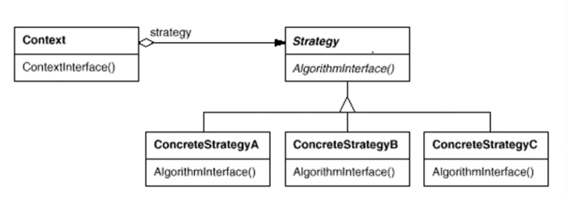

“组件协作”模式

动机：

- 软件构件过程中，某些对象使用的算法可能多种多样样，经常改变，将算法都编码会导致对象非常复杂，支持算法也是一种负担。

- 如何在运行时根据需要透明地更改对象的算法？将算法与对象本身解耦，从而避免上述问题？

例: Stratege1.cpp

以动态的角度来看问题，有一个时间轴的概念，问题在动态中得以暴露。

1. 修改枚举类型
2. 更改if-else

违反开闭原则，对扩展开放，对更改关闭。应该用扩展的方式来应对变化。代价->重新编译，重新测试，重新部署...

把一个个算法变成了子类。

`31行`需要声明为指针以支持多态的调用。使用工厂模式来创建该指针。

复用性->二进制层面意义的复用性，而不是源代码片段级的复用。

扩展式的方式。

---

定义一系列算法，把它们一个个封装起来，并且使它们可互相替换（变化）。该模式使得算法可独立于使用它的客户程序（稳定）而变化（扩展，子类化）。——《设计模式》 GoF

---

- Strategy及其子类为组件提供了一系列可重用的算法，从而可以使得类型在运行时方便地根据需要在各个算法之间进行切换。
- Strategy模式提供了用条件判断语句以外的另一种选择，消除条件判断语句，就是在解耦合。含有许多条件判断语句的代码通常都需要Strategy模式。 if-else是结构化的分而治之的思想，if-else一般是扩展的标志。
- 如果Strategy对象没有实例变量，那么各个上下文可以共享同一个Strategy对象，从而节省对象开销。代码具有良好的本地性。加载到CPU的高级缓存里。